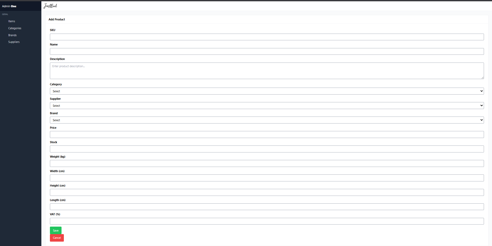
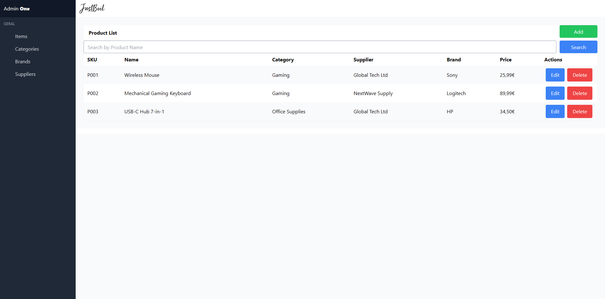
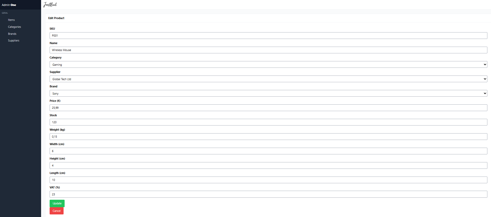
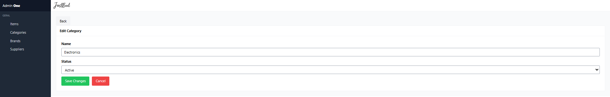
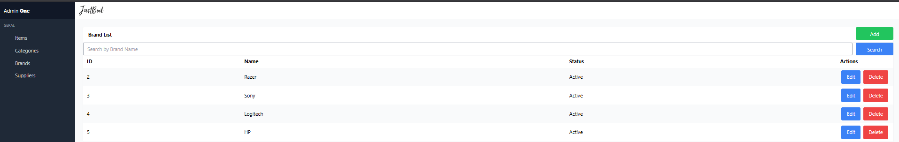
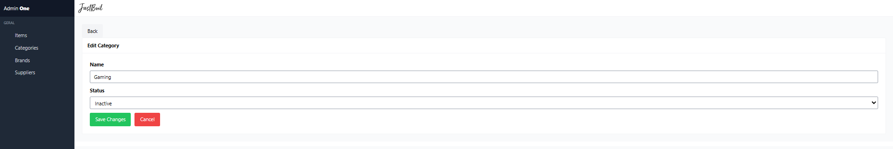
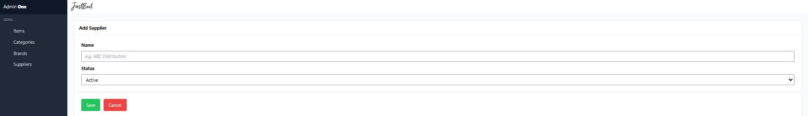
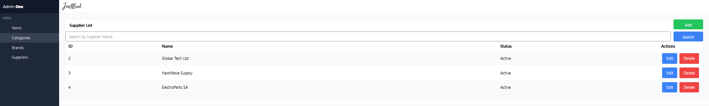
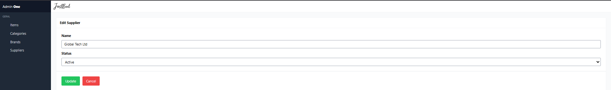

# 🧾 Sistema de Gestão de Stock


Aplicação web desenvolvida com **Laravel (PHP)** e **MariaDB**, com funcionalidades completas de **CRUD**, autenticação e painel administrativo.  
Projeto desenvolvido no âmbito da licenciatura em Engenharia Informática.

## ✨ Funcionalidades
- Autenticação de utilizadores (login/registo)
- Criação, edição e remoção de produtos
- Filtros por categoria e estado do stock
- Painel administrativo com resumo de dados
- Interface responsiva com Bootstrap
- Utilização do **Vite** para compilação do frontend

## 🛠️ Tecnologias e Ferramentas Utilizadas
- **Linguagem:** PHP 8.x  
- **Framework:** Laravel 10  
- **Base de Dados:** MariaDB  
- **Gestão da BD:** DBeaver  
- **Frontend:** Blade, HTML, CSS, Bootstrap  
- **Build e Dev Server:** Vite (`npm run dev`)  
- **Outras ferramentas:** Git, Composer, VS Code

  ## 📸 Capturas de Ecrã

### Painel Adicionar Produtos


### List Produto


### Edit Produto


### Add Category


### List Category


### Edit Category


### Add Brands


### List Brands


### Edit Brands


### Add Suppliers


### List Suppliers


### Edit Suppliers



## 🚀 Como executar localmente

```bash
# Clonar o repositório
git clone https://github.com/teu-username/stock-management-laravel.git
cd stock-management-laravel

# Instalar dependências do backend
composer install

# Instalar dependências do frontend
npm install

# Copiar ficheiro .env e gerar chave
cp .env.example .env
php artisan key:generate

# Configurar a base de dados no .env
DB_DATABASE=nome_da_base
DB_USERNAME=teu_utilizador
DB_PASSWORD=sua_password

# Migrar as tabelas
php artisan migrate

# Iniciar o servidor Laravel
php artisan serve

# Iniciar Vite (servidor de desenvolvimento do frontend)
npm run dev


