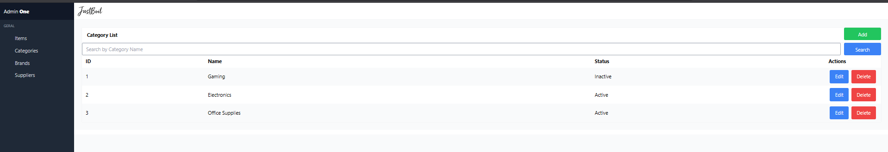

# 🧾 Stock Management System


Web application developed with **Laravel (PHP)** and **MariaDB**, with full **CRUD** functionality, authentication, and administrative panel.
Project developed as part of a degree in Computer Engineering.

## ✨ Features
- User authentication (login/registration)
- Creation, editing, and removal of products
- Filters by category and stock status
- Administrative panel with data summary
- Responsive interface with Bootstrap
- Use of **Vite** for frontend compilation

## 🛠️ Technologies and Tools Used
- **Language:** PHP 8.x
- **Framework:** Laravel 10  
- **Database:** MariaDB  
- **DB Management:** DBeaver  
- **Frontend:** Blade, HTML, CSS, Bootstrap  
- **Build and Dev Server:** Vite (`npm run dev`)  
- **Other tools:** Git, Composer, VS Code

  ## 📸 Screenshots

### Add Products Panel


### List Produto


### Edit Produto


### Add Category


### List Category


### Edit Category


### Add Brands


### List Brands


### Edit Brands


### Add Suppliers


### List Suppliers


### Edit Suppliers


## 🚀 How to run locally

```bash
# Clone the repository
git clone https://github.com/teu-username/stock-management-laravel.git
cd stock-management-laravel

# Install backend dependencies
composer install

# Install frontend dependencies
npm install

# Copy .env file and generate key
cp .env.example .env
php artisan key:generate

# Configure the database in .env
DB_DATABASE=nome_da_base
DB_USERNAME=teu_utilizador
DB_PASSWORD=sua_password

# Migrate the tables
php artisan migrate

# Start the Laravel server
php artisan serve

# Start Vite (frontend development server)
npm run dev


